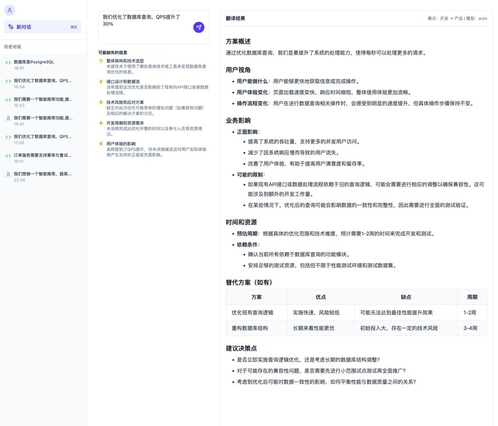

# workTranslationAgent

**职能沟通翻译助手** - 弥合产品经理与开发工程师之间的沟通鸿沟。

workTranslationAgent 是一款基于大语言模型的智能翻译工具，能够自动识别输入文本的视角（产品/开发），分析缺失的关键信息，并将内容翻译成对方更容易理解的语言。

#### 功能说明

- **这个工具做什么？**
  
  workTranslationAgent 是一个专门用于产品经理（PM）和开发工程师（DEV）之间沟通的智能翻译助手。它能够理解不同角色的表达方式，自动识别输入内容是从产品视角还是开发视角出发，然后将内容"翻译"成对方更容易理解的语言，同时主动发现并提示沟通中可能遗漏的关键信息。

- **有哪些核心功能？**
  
  - **缺失信息分析**：根据识别的视角类型，使用差异化的检查点分析缺失的关键信息，并提供补充建议
  - **智能双向翻译**：支持 PM→DEV（产品需求转技术方案）和 DEV→PM（技术方案转业务语言）两种翻译方向
  - **流式实时输出**：采用 SSE 技术实现实时流式输出，翻译结果边生成边呈现，提升用户体验
  - **历史记录管理**：所有翻译记录持久化存储，支持详情查看，方便回顾和追溯

## 核心价值

- **消除理解偏差**：产品需求不再模糊，技术方案不再晦涩
- **主动发现盲点**：识别沟通中遗漏的关键信息
- **实时反馈**：流式输出，边生成边呈现

---
## 前端页面

### 首页


### 翻译结果页


## 技术栈

### 后端

| 组件 | 版本 | 用途 |
|------|------|------|
| Python | 3.13+ | 运行时 |
| FastAPI | 0.127.0 | Web 框架 |
| LangGraph | 1.0.5 | Agent 编排 |
| LangChain | 1.2.0 | LLM 集成 |
| DashScope | 1.25.5 | 通义千问 API |
| PostgreSQL | 15+ | 关系数据库 |
| SQLAlchemy | 2.0.45 | ORM |
| Alembic | 1.17.2 | 数据库迁移 |
| Redis | 6.4.0 | 状态检查点 |
| sse-starlette | 3.0.4 | SSE 支持 |
| dependency-injector | 4.48.3 | 依赖注入 |

### 前端

| 组件 | 版本 | 用途 |
|------|------|------|
| React | 19.2.3 | UI 框架 |
| TypeScript | 5.9.3 | 类型系统 |
| Tailwind CSS | 4.1.18 | 样式框架 |
| Vite | 6.0.0 | 构建工具 |
| React Router | 7.11.0 | 路由管理 |
| lucide-react | 0.562.0 | 图标库 |

---

## 快速开始

### 环境要求

- Python 3.13+
- Node.js 20+
- pnpm（推荐）或 npm
- PostgreSQL 15+（需要手动安装和配置）
- Redis 7+（需要手动安装和配置）

### 1. 克隆仓库

```bash
git clone https://github.com/haoliqiang/workTranslationAgent.git
cd workTranslationAgent
```

### 2. 配置数据库和 Redis

确保 PostgreSQL 和 Redis 服务已启动并运行。

### 3. 后端启动

```bash

# 安装依赖
pip install -r backend/requirements.txt

# 进入后端目录
cd backend

# 设置 DashScope API Key（必需，或在 config.yaml 中配置）
export DASHSCOPE_API_KEY=your_api_key

# 启动服务（自动执行数据库迁移）
python -m uvicorn src.main:app --reload --port 8000
```

后端服务地址：http://localhost:8000

API 文档：http://localhost:8000/docs

### 4. 前端启动

```bash
# 回到仓库根目录
cd ..

# 安装依赖
pnpm install

# 启动开发服务器
cd frontend
pnpm dev
```

前端服务地址：http://localhost:5000

### 5. 开始使用

1. 访问 http://localhost:5000
2. 在聊天页面选择角色和大模型，输入需求或技术方案
3. 系统翻译成对应内容

---

## 配置说明

配置文件位于 `backend/config.yaml`。


### 环境变量

| 变量名 | 必填 | 说明 |
|--------|------|------|
| DASHSCOPE_API_KEY | 是 | 通义千问 API Key，获取地址：https://dashscope.console.aliyun.com/ |

---

## 智能 Agent 工作流

workTranslationAgent 采用 LangGraph 构建智能工作流：

```
┌─────────────────────────────────────┐
│  用户输入        │
└─────────────────────────────────────┘

    │
    ▼
┌─────────────────────────────────────┐
│  缺失分析        │
│  ─────────────────────────────────  │
│  • 根据视角选择检查点                    │
│  • 识别缺失的关键信息                    │
│  • 生成补充建议                         │
└─────────────────────────────────────┘
    │
    ▼
┌─────────────────────────────────────┐
│  执行翻译         │
│  ─────────────────────────────────  │
│  • 选择对应翻译提示词                    │
│  • 融入缺失信息上下文                    │
│  • 流式生成翻译结果                      │
└─────────────────────────────────────┘
    │
    ▼
┌─────────────────────────────────────┐
│  页面显示        │
│  ─────────────────────────────────  │
│  • 翻译结果                          │
│  • 缺失分析                          │
│  • 补充建议                          │
└─────────────────────────────────────┘
```

### 翻译策略

**PM → DEV 翻译**（产品需求 → 技术方案）：
- 结构化输出：将模糊需求转化为清晰功能点
- 技术可行性：用技术术语描述实现
- 边界明确：明确功能边界和异常处理
- 可衡量：将体验指标转化为技术指标

**DEV → PM 翻译**（技术方案 → 业务语言）：
- 去技术化：用业务场景代替技术术语
- 可视化：用流程图思维辅助说明
- 结果导向：强调对用户和业务的影响
- 风险可视：用业务影响描述技术风险

---


## 项目结构

```
workTranslationAgent/
├── backend/
│   ├── src/
│   │   ├── main.py              # 应用入口
│   │   ├── config.py            # 配置管理
│   │   ├── container.py         # 依赖注入容器
│   │   ├── core/                # 核心模块
│   │   │   ├── api/             # API 响应格式
│   │   │   ├── cache/           # Redis 缓存服务
│   │   │   ├── config/          # 配置加载器
│   │   │   ├── context/         # 请求上下文
│   │   │   ├── database/        # 数据库连接/迁移
│   │   │   ├── logging/         # 日志配置
│   │   │   ├── sse/             # SSE 事件处理
│   │   │   └── type/            # 类型定义
│   │   ├── dao/translate/    # 翻译业务域
│   │   │   ├── agent/           # LangGraph Agent
│   │   │   │   ├── translate_agent.py  # Agent 实现
│   │   │   │   └── tools.py     # 工具函数
│   │   │   ├── api/routes.py    # API 路由
│   │   │   ├── graph/           # 检查点管理
│   │   │   ├── model/           # 数据模型
│   │   │   ├── prompts/         # 提示词
│   │   │   │   ├── pm_to_dev.py # PM→DEV 提示词
│   │   │   │   └── dev_to_pm.py # DEV→PM 提示词
│   │   │   ├── repository/      # 仓储层
│   │   │   ├── schema/          # 请求/响应模型
│   │   │   └── service/         # 服务层
│   │   └── llm/                 # LLM 适配器
│   │       └── dashscope.py     # DashScope 适配
│   ├── alembic/                 # 数据库迁移
│   ├── config.yaml              # 配置文件
│   └── pyproject.toml           # Python 依赖
│
└── frontend/
│       ├── src/
│       │   ├── App.tsx              # 根组件
│       │   ├── api/                 # API 类型定义
│       │   ├── components/          # React 组件
│       │   │   ├── layout/          # 布局组件
│       │   │   └── Result.tsx       # 结果展示组件
│       │   ├── config/              # 配置文件
│       │   ├── hooks/               # 自定义 Hook
│       │   │   └── useTranslate.ts  # 翻译状态管理
│       │   ├── pages/               # 页面组件
│       │   │   └── ChatPage.tsx     # 聊天页
│       │   ├── router/              # 路由配置
│       │   └── utils/               # 工具函数
│       ├── package.json
│       └── vite.config.ts
```

---

